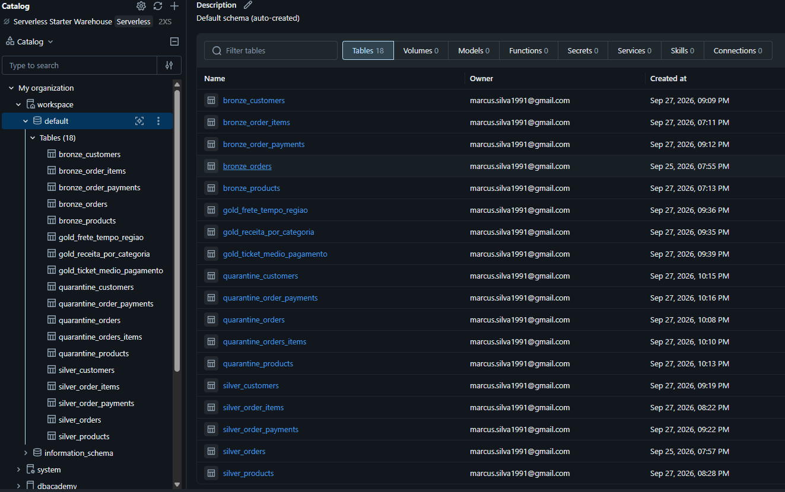
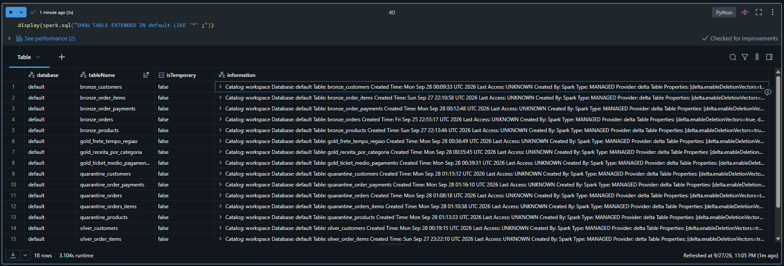
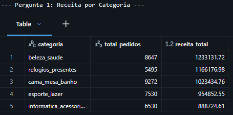
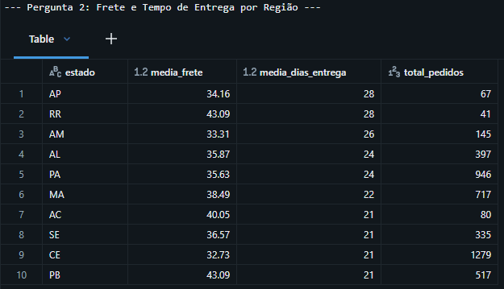
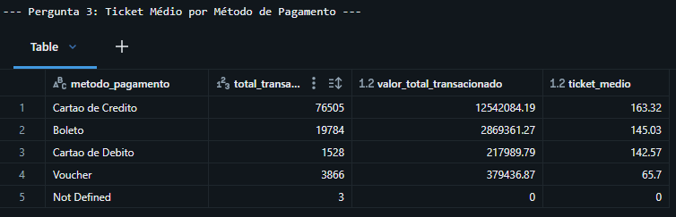

# MVP de Engenharia de Dados - E-Commerce Olist (Databricks & Lakehouse)

Repositório desenvolvido como parte do MVP (Minimum Viable Product) de Engenharia de Dados da pós-graduação. O projeto implementa um pipeline de dados analítico de ponta a ponta utilizando a arquitetura moderna baseada no conceito **Medallion (Bronze, Silver, Quarentena e Gold)** no **Databricks** (Unity Catalog, PySpark e Delta Lake).

---

## 1. Contexto de Negócios, Perguntas e Licença dos Dados

### Contexto de Negócio e o Problema Integrado
O objetivo central deste projeto é responder a um **problema estratégico integrado**: *Como a eficiência operacional de entrega e os padrões de pagamento impactam a receita e o valor gerado por categoria de produto no e-commerce?* 

Para solucionar este desafio de forma holística, o pipeline correlaciona três frentes fundamentais do negócio:
1. **Identificação de Receita:** Quais categorias impulsionam o faturamento da empresa.
2. **Eficiência Logística:** O impacto do frete e do tempo de entrega nas diferentes regiões geográficas do país.
3. **Comportamento de Compra:** O peso dos métodos de pagamento no ticket médio das transações.

### Perguntas Analíticas de Negócio
* **Pergunta 1:** Qual é a categoria de produto que gera a maior receita total para a empresa?
* **Pergunta 2:** Existe correlação entre o valor do frete e o tempo de entrega por região geográfica?
* **Pergunta 3:** Qual é o ticket médio das compras agrupadas por método de pagamento?

### Resumo da Estrutura dos Dados Brutos
O projeto utiliza o conjunto de dados **Brazilian E-Commerce Public Dataset by Olist** (disponibilizado via Kaggle), que contém informações reais de cerca de 100 mil pedidos realizados entre 2016 e 2018 em múltiplos marketplaces no Brasil. As tabelas originais englobam:
* `orders` (Pedidos): IDs de pedidos, status, datas de compra, aprovação, envio e entrega.
* `order_items` (Itens do Pedido): Relação de produtos por pedido, IDs de vendedores, preços e custos de frete.
* `products` (Produtos): Metadados dos produtos, incluindo categorias e dimensões físicas.
* `customers` (Clientes): Dados geográficos dos clientes (cidade e estado).
* `order_payments` (Pagamentos): Informações sobre os meios de pagamento utilizados, número de parcelas e valores.

### Licença dos Dados
O conjunto de dados da Olist é disponibilizado sob a licença **Creative Commons Attribution-NonCommercial-ShareAlike 4.0 International (CC BY-NC-SA 4.0)**. Esta licença permite a partilha e adaptação dos dados para fins educacionais e não comerciais, desde que seja atribuída a devida autoria à Olist.

---

## 2. Carga dos Dados

A ingestão dos dados brutos foi efetuada através da leitura dos ficheiros CSV originais armazenados no **Unity Catalog Volumes** do Databricks. 
* O processo de carga lê os ficheiros de origem utilizando o motor distribuído do **Apache Spark**.
* Durante a carga para a Camada Bronze, foram incorporados metadados de auditoria e controlo operacional (`ingestion_timestamp` e `source_file`) para garantir a rastreabilidade da origem dos dados.
* O script completo responsável por esta e pelas demais etapas encontra-se documentado e versionado no repositório no notebook: `etl_ecommerce_medallion (1).ipynb`.

---

## 3. Modelagem e Catálogo de Dados

A arquitetura do Lakehouse foi estruturada em camadas bem definidas para separar a auditoria bruta, o tratamento de qualidade (Silver/Quarentena) e a modelagem analítica (Gold).

### Catálogo de Dados Transcrito (Principais Tabelas)

* **Camada Silver (Dados Tratados):**
  * `silver_orders`: Contém pedidos limpos, com conversão de tipos (*Timestamp*) e remoção de nulos em chaves críticas.
  * `silver_order_items`: Itens associados a pedidos válidos, com valores monetários tipados para *Double*.
  * `silver_products`: Catálogo de produtos com tradução e padronização de categorias.
  * `silver_customers`: Dados cadastrais de clientes limpos e padronizados por estado (`customer_state`) e cidade.
  * `silver_order_payments`: Transações de pagamento tratadas, com padronização e tradução textual de métodos (*Cartao de Credito*, *Cartao de Debito*, etc.).

* **Camada Quarentena (Dados Rejeitados):**
  * `quarantine_orders`, `quarantine_orders_items`, `quarantine_products`, `quarantine_customers`, `quarantine_order_payments`: Tabelas dedicadas a isolar proativamente os registos corrompidos, incompletos ou órfãos, enriquecidos com a coluna `error_reason` e o carimbo `quarantine_timestamp`.

* **Camada Gold (Tabelas Analíticas):**
  * `gold_receita_por_categoria`: Agregação de receita total e volume de vendas agrupados por categoria de produto.
  * `gold_frete_tempo_regiao`: Cruzamento geográfico calculando a média do frete e do tempo de entrega (em dias) por estado do cliente.
  * `gold_ticket_medio_pagamento`: Métricas financeiras agrupadas por método de pagamento (quantidade de transações, valor total e ticket médio).

> **Screenshots do Unity Catalog:**
> 

---

## 4. Pipeline de Dados (ETL)

O pipeline de dados foi inteiramente estruturado e executado de forma sequencial num **único notebook principal** (`etl_ecommerce_medallion (1).ipynb`). A escolha de um único notebook coeso facilitou a reprodutibilidade ponta a ponta e a visualização lógica das dependências entre as camadas:
1. **Bloco 1:** Configuração do ambiente, caminhos dos Volumes e leitura dos CSVs brutos (`Bronze`).
2. **Bloco 2:** Aplicação de regras de negócio, validações de integridade estrutural, desvio de registos inválidos (`Quarantine`) e limpeza rigorosa (`Silver`).
3. **Bloco 3:** Cruzamentos relacionais (*joins*) e agregações analíticas orientadas a responder às perguntas de negócio (`Gold`).

> ☁️ **Evidência de Persistência na Nuvem:**
> Todas as tabelas foram gravadas com sucesso no formato otimizado **Delta Lake** utilizando o comando `.write.format("delta").saveAsTable(...)`, garantindo transações ACID e persistência no storage em nuvem do Databricks Unity Catalog.
> 

---

## 5. Qualidade de Dados e Tratamento de Erros

Durante a transição da Camada Bronze para a Silver, foram detetados e tratados os seguintes problemas críticos de qualidade:
* **Valores Nulos e Chaves Órfãs:** Registo de itens ou pagamentos associados a IDs de pedidos inexistentes. 
  * *Solução:* Implementação de filtros de validação que desviaram automaticamente estas linhas anómalas para as tabelas de **Quarentena**, gravando o motivo exato da falha na coluna `error_reason`.
* **Inconsistências de Tipagem:** Campos de data em formato string e valores numéricos com pontuações incorretas.
  * *Solução:* Conversão explícita de tipos com funções do PySpark (`to_timestamp`, `cast("double")`).
* **Padronização de Strings e Nomes:** Presença de acentos, variações de maiúsculas/minúsculas e termos desalinhados nos meios de pagamento.
  * *Solução:* Padronização textual com funções de string e tradução/normalização dos métodos de pagamento para facilitar a agregação analítica.

---

## 6. Análise de Dados (Respostas às Perguntas)

As consultas executadas sobre as tabelas materializadas na Camada Gold permitiram extrair as seguintes respostas estruturadas para o negócio:

1. **Receita por Categoria (`gold_receita_por_categoria`):** O faturamento da Olist concentra-se fortemente em categorias de bens de consumo de alta procura, com destaque para *beleza_saude*, *relogios_presentes* e *cama_mesa_banho*.

   
2. **Logística e Geografia (`gold_frete_tempo_regiao`):** Identificou-se uma clara disparidade regional. Estados localizados nas regiões Norte e Nordeste (como Amapá, Roraima e Amazonas) enfrentam prazos médios de entrega superiores a 25 dias e custos de frete proporcionalmente muito mais elevados.

   
3. **Comportamento de Pagamento (`gold_ticket_medio_pagamento`):** O *Cartão de Crédito* lidera de forma absoluta o volume de transações e apresenta o maior ticket médio (~R$ 163), evidenciando a dependência do parcelamento para compras de maior valor no e-commerce.

   

Problema: **Como a eficiência operacional de entrega e os padrões de pagamento impactam a receita e o valor gerado por categoria de produto no e-commerce?**

Solução: O problema central reside em equilibrar a experiência do cliente através da logística de *frete/prazos* com o incentivo aos *meios de pagamento* de maior ticket (crédito), maximizando a receita nas *categorias* campeãs de vendas sem perder margem nas regiões mais distantes.

---

## 7. Autoavaliação

* **Objetivos:** Os objetivos para este MVP foram alcançados. O pipeline executa com sucesso desde a ingestão crua dos dados até à disponibilização de tabelas analíticas limpas e auditadas em arquitetura Lakehouse Medallion, incorporando o tratamento de quarentena.
* **Dificuldades Encontradas:** A principal dificuldade residiu no tratamento de inconsistências relacionais (chaves estrangeiras órfãs) sem perder a visibilidade dos erros operacionais. O desafio foi superado com a conceção estruturada da Camada de Quarentena, permitindo auditar os dados defeituosos sem corromper o fluxo analítico principal.
* **Trabalhos Futuros:** Para enriquecer este projeto num futuro portfólio profissional, planejo:
  1. Automatizar a execução do pipeline através de orquestradores como o **Databricks Workflows** ou **Apache Airflow**.
  2. Implementar testes unitários automatizados para a qualidade dos dados utilizando ferramentas como o **Great Expectations**.
  3. Conectar a Camada Gold a uma ferramenta de Business Intelligence (como Power BI ou Tableau) para construção de um dashboard executivo interativo.

---

## Como Executar o Projeto

1. **Configuração do Ambiente:** No Databricks, crie um Catalog/Schema e um Unity Catalog Volume, fazendo o upload dos ficheiros CSV da Olist.
2. **Execução:** Clone este repositório para o seu Databricks Repos, abra o notebook `etl_ecommerce_medallion.ipynb` e execute as células sequencialmente para gerar as camadas Bronze, Quarentena, Silver e Gold.
